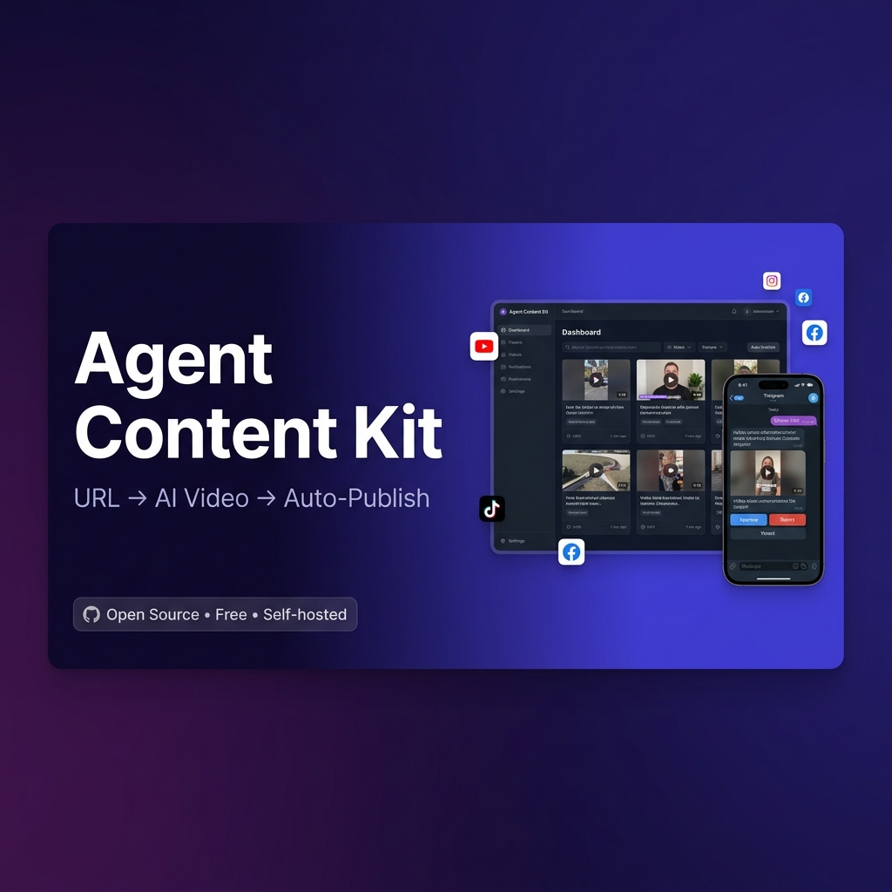
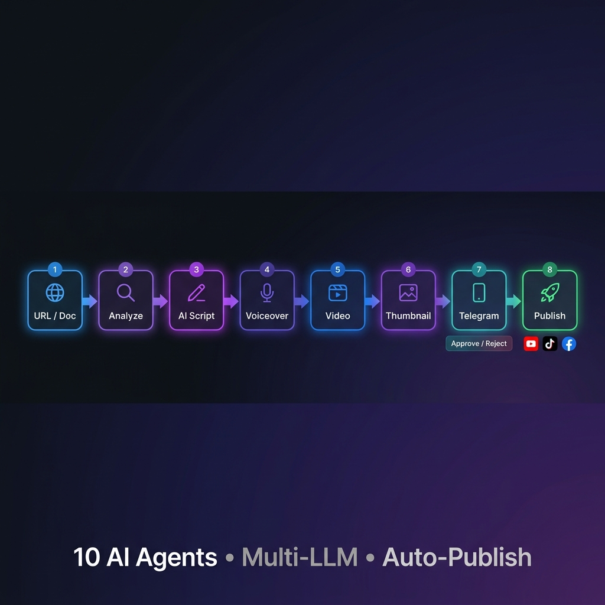

<p align="center">
  
</p>

<p align="center">
  <strong>Open-source AI pipeline that turns any URL or document into a published short-form video — fully automated.</strong>
</p>

<p align="center">
  <a href="https://github.com/vovuhuydeveloper/agent-content-kit/actions"></a>
  <a href="LICENSE"></a>
  
  
  
  
  <a href="https://github.com/vovuhuydeveloper/agent-content-kit/stargazers"></a>
</p>

---

## 🧠 How It Works

<p align="center">
  
</p>

> Give it **any URL or document** → 10 AI agents generate a script, record a voiceover, compose a video, and auto-publish to YouTube, TikTok and Facebook — with a Telegram approval step in between.

---

## ✨ Features

| Feature | Description |
|---------|-------------|
| 🤖 **10-Agent Pipeline** | Fetch → Analyze → Script → A/B Test → Voice → Video → Thumbnail → Review → Notify → Publish |
| 🧠 **Multi-LLM** | Swap between OpenAI GPT-4, Claude, or Gemini with one config change |
| 📄 **Any Source** | URL, YouTube link, PDF, DOCX, or plain text as input |
| 📱 **Telegram Approval** | Receive video preview + approve/reject buttons directly in Telegram |
| 🚀 **Auto-Publish** | Upload to YouTube, TikTok and Facebook via browser automation — no OAuth needed |
| 📅 **Content Calendar** | Schedule recurring video creation with cron — daily, weekly, any cadence. Zero manual work. |
| 📊 **Analytics Dashboard** | Track views, likes, engagement across all platforms |
| 🧪 **A/B Testing** | Auto-generate multiple script variants to pick the best one |
| 🎨 **Modern Dashboard** | React + Material UI frontend with real-time pipeline status |
| 🐳 **Docker Ready** | One-command deploy with Docker Compose |

---

## 🐳 Quick Start with Docker (Recommended)

**Fastest way to get running in 2 minutes.**

### ⚠️ Prerequisite: Docker Desktop

Docker Desktop must be installed and **running**.

- **macOS/Windows/Linux:** Download from [docker.com/products/docker-desktop](https://www.docker.com/products/docker-desktop/)
- **Start Docker Desktop** before proceeding (look for the whale icon in menu bar/taskbar)

### 1. Clone & Configure

```bash
git clone https://github.com/vovuhuydeveloper/agent-content-kit.git
cd agent-content-kit

# Create environment config from template
cp .env.example .env

# IMPORTANT: Edit .env and add your API keys
# Minimum required: OPENAI_API_KEY + PEXELS_API_KEY
# See "Required API Keys" section below for details
```

### 2. Start Everything

```bash
# Start all services (API + Celery + Redis)
docker compose -f docker-compose.agents.yml up -d
```

That's it! All services start automatically:
- FastAPI backend (port 8000)
- Celery worker (background tasks)
- Celery beat (scheduler)
- Redis (task queue)

### 3. Open Dashboard

Navigate to **http://localhost:8000** — the Setup Wizard will guide you through the rest!

---

## 🔧 Alternative: Manual Setup (Python)

If you prefer running locally without Docker:

### Prerequisites

- **Python 3.9+**
- **Node.js 18+** (for dashboard)
- **FFmpeg** — required for video composition
- **yt-dlp** — required for content fetching
- **Google Chrome** — required for auto-publishing

**macOS:**
```bash
brew install ffmpeg yt-dlp
```

**Ubuntu/Debian:**
```bash
sudo apt update && sudo apt install ffmpeg
pip install yt-dlp
```

> ⚠️ **FFmpeg is required** — without it, videos will not render. Verify with `ffmpeg -version`

### Installation Steps

```bash
# 1. Create virtual environment
python3 -m venv venv

# 2. Activate it (IMPORTANT!)
# macOS/Linux:
source venv/bin/activate
# Windows: venv\Scripts\activate

# 3. Install dependencies
pip install --upgrade pip
pip install -r requirements.txt

# 4. Install Playwright browser
playwright install chromium

# 5. Build dashboard
cd dashboard
npm install
npm run build
cd ..

# 6. Start the server
uvicorn backend.main:app --host 0.0.0.0 --port 8000 --reload
```

Open **http://localhost:8000** to access the dashboard.

---

## 🔑 Required API Keys

### Minimum Setup (Required)

| Key | Description | Cost | How to Get |
|-----|-------------|------|------------|
| **LLM_PROVIDER** | Choose: `openai`, `claude`, or `gemini` | Free | Set in `.env` file |
| **OPENAI_API_KEY** | Required if `LLM_PROVIDER=openai` | Pay-per-use | [platform.openai.com/api-keys](https://platform.openai.com/api-keys) |
| **PEXELS_API_KEY** | Stock video footage (required for video creation) | **Free** | [pexels.com/api](https://www.pexels.com/api/) — instant approval |

### Recommended (For Full Experience)

| Key | Description | Cost |
|-----|-------------|------|
| **TELEGRAM_BOT_TOKEN** | For video approval notifications | Free via [@BotFather](https://t.me/BotFather) |
| **TELEGRAM_CHAT_ID** | Your chat ID (auto-detected in Setup Wizard) | Free |

### Optional

| Key | Description | Cost |
|-----|-------------|------|
| **ELEVENLABS_API_KEY** | Premium voice synthesis (falls back to free `edge-tts`) | Freemium |
| **ANTHROPIC_API_KEY** | Alternative LLM (if `LLM_PROVIDER=claude`) | Pay-per-use |
| **GOOGLE_API_KEY** | Alternative LLM (if `LLM_PROVIDER=gemini`) | Pay-per-use |

> **Quick start:** Set `LLM_PROVIDER=openai`, add your `OPENAI_API_KEY` and `PEXELS_API_KEY` — that's all you need to create your first video.
> **No Telegram?** The system still works, but you'll need to manually approve jobs via the Dashboard before auto-publishing.

---

## 📱 Auto-Publishing (No OAuth Required)

Auto-publishing uses **Playwright browser automation** with a real Chrome session. No developer apps, no API keys — just login once.

### Connect Platforms

```bash
# One-time login (opens Chrome window)
python -m backend.core.browser_session login youtube
python -m backend.core.browser_session login tiktok
python -m backend.core.browser_session login facebook
```

Or go to **http://localhost:8000/connections** → click **Connect** for each platform.

| Platform | Method | Format |
|----------|--------|--------|
| **YouTube** | YouTube Studio automation | Shorts 9:16, max 60s |
| **TikTok** | tiktok.com/upload automation | 9:16, max 10 min |
| **Facebook** | Reels creator automation | 9:16, max 90s |

---

## 📅 Content Calendar — Set It and Forget It

Agent Content Kit's scheduler runs **fully automatically** on a cron schedule. Define a template once — it creates and publishes new videos every day without any manual input.

### How the Scheduler Works

```
⏰ Celery Beat ticks every minute
     ↓
Finds schedules that are due
     ↓
Auto-creates a new ContentJob from the template
     ↓
🤖 Runs the full 10-agent pipeline
     ↓
📱 Sends video preview to Telegram for approval
     ↓
✅ Approve → auto-publishes to YouTube / TikTok / Facebook
```

### Create a Schedule (via API)

```bash
curl -X POST http://localhost:8000/api/v1/schedules/ \
  -H "Content-Type: application/json" \
  -d '{
    "name": "Daily TikTok from VnExpress",
    "cron_expression": "0 9 * * *",
    "source_url": "https://vnexpress.net",
    "video_count": 3,
    "platforms": ["tiktok", "youtube"],
    "language": "vi",
    "niche": "news"
  }'
```

### Or Use the Dashboard

Go to **http://localhost:8000** → **Calendar** tab → click **+ New Schedule**

### Cron Expression Cheat Sheet

| Cron | Meaning |
|------|---------|
| `0 9 * * *` | Every day at 9:00 AM |
| `0 9,17 * * *` | Every day at 9 AM and 5 PM |
| `0 8 * * 1-5` | Weekdays at 8 AM |
| `0 8 * * 1,3,5` | Mon, Wed, Fri at 8 AM |
| `0 9 * * 1` | Every Monday at 9 AM |
| `0 */6 * * *` | Every 6 hours |

### Schedule Management

```bash
# List all schedules
GET /api/v1/schedules/

# Trigger a schedule immediately (for testing)
POST /api/v1/schedules/{id}/run-now

# Enable / disable a schedule
POST /api/v1/schedules/{id}/toggle

# Update cron timing
PUT /api/v1/schedules/{id}
```

### Requirements

> ⚠️ The Content Calendar requires **Celery + Redis** running alongside the API.

```bash
# Option A: Docker Compose (recommended)
docker compose -f docker-compose.agents.yml up -d
# Includes API + Celery Worker + Celery Beat + Redis automatically

# Option B: Manual
uvicorn backend.main:app --host 0.0.0.0 --port 8000  # Terminal 1
celery -A backend.core.celery_app worker --loglevel=info -Q processing  # Terminal 2
celery -A backend.core.celery_app beat --loglevel=info  # Terminal 3
```

---

## 💬 Telegram Approval Flow

```
Pipeline completes
     ↓
📱 Telegram sends: preview message + video file + thumbnail
     ↓
[✅ Approve & Upload]   [❌ Reject]
     ↓
✅ → Auto uploads to YouTube, TikTok, Facebook
❌ → Job marked as rejected, no upload
```

**Setup (2 minutes):**
1. Open Telegram → search **@BotFather** → send `/newbot`
2. Copy the token into `.env` as `TELEGRAM_BOT_TOKEN`
3. Open your bot → send `/start`
4. Go to **Setup Wizard → Telegram** → click **"Detect my Chat ID"**
5. ✅ Done!

---

## 🧪 API Reference

| Group | Endpoints |
|-------|-----------|
| **Content Jobs** | `POST /api/v1/content-jobs/` · `GET /api/v1/content-jobs/` · `GET /api/v1/content-jobs/{id}` |
| **Config** | `GET /api/v1/config/keys` · `POST /api/v1/config/keys` · `POST /api/v1/config/keys/validate` |
| **Browser Sessions** | `GET /api/v1/browser-session/status` · `POST /api/v1/browser-session/{platform}/connect` |
| **Telegram** | `POST /api/v1/config/telegram/test` · `POST /api/v1/config/telegram/detect-chat` |
| **Calendar** | `GET /api/v1/schedules/` · `POST /api/v1/schedules/` |
| **Analytics** | `GET /api/v1/analytics/overview` · `GET /api/v1/analytics/top-videos` |

Interactive docs: **http://localhost:8000/docs**

---

## 🐛 Troubleshooting

### "uvicorn: command not found"

**Cause:** Virtual environment not activated.

**Fix:** Either activate the venv first:
```bash
source venv/bin/activate
uvicorn backend.main:app --host 0.0.0.0 --port 8000
```

Or use the full path:
```bash
./venv/bin/uvicorn backend.main:app --host 0.0.0.0 --port 8000
```

### Dashboard not loading / 404 errors

**Cause:** Dashboard not built or built incorrectly.

**Fix:** Rebuild the dashboard:
```bash
cd dashboard
npm run build
cd ..
```

### "API key configuration not found" warning

**Cause:** `.env` file missing or required API keys not set.

**Fix:** Ensure `.env` exists and contains at least `OPENAI_API_KEY` and `PEXELS_API_KEY`.

### FFmpeg errors during video creation

**Cause:** FFmpeg not installed or not in PATH.

**Fix:** Install FFmpeg and verify with `ffmpeg -version`.

---

## 🤝 Contributing

1. Fork the repo
2. Create a feature branch: `git checkout -b feature/amazing`
3. Commit your changes
4. Push: `git push origin feature/amazing`
5. Open a Pull Request

All contributions welcome — bug fixes, new uploaders, new LLM providers, UI improvements.

---

## 📬 Contact & Support

<table>
  <tr>
    <td align="center">
      <br />
      <b>💬 Telegram</b><br />
      Chat with me for support
    </td>
    <td align="center">
      <br />
      <b>☕ Buy me a coffee</b><br />
      Support via MoMo
    </td>
  </tr>
</table>

---

## 🙏 Credits

- [OpenAI](https://openai.com) / [Anthropic](https://anthropic.com) / [Google](https://ai.google.dev) — LLM providers
- [Pexels](https://pexels.com) — Free stock videos
- [Playwright](https://playwright.dev) — Browser automation
- [FFmpeg](https://ffmpeg.org) — Video processing
- [edge-tts](https://github.com/rany2/edge-tts) — Free text-to-speech
- [Material UI](https://mui.com) — Dashboard components

---

## 📝 License

MIT License — free for personal and commercial use.

---

<p align="center">
  Made with ❤️ by <a href="https://github.com/vovuhuydeveloper">vovuhuydeveloper</a>
  <br/><br/>
  If this project saved you time, <a href="https://github.com/vovuhuydeveloper/agent-content-kit/stargazers">⭐ give it a star!</a>
</p>
